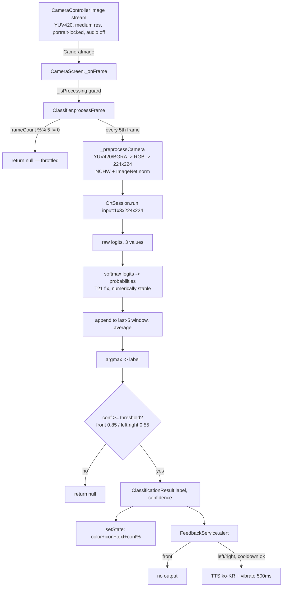

# Architecture — crosswalk_app (횡단보도 이탈 감지)

Owner: architect (see AGENTS.md). Others read-only.
Last updated: 2026-07-18 (added §16 — T35 chest-mount posture vs. preprocessing/model review). Prior: 2026-07-16 (synced against T9/T10/T21/T23/T24/T25 fixes and T22 ONNX export-path trace, see `docs/Tasks.md`). Basis: direct inspection of `crosswalk_app/lib/**`, `crosswalk_app/test/**`, `crosswalk_app/pubspec.yaml`, `.github/workflows/build_apk.yml`, `train/train_model.py`, `train/export_onnx.py`, git history (commits `30a799e`, `3153d50`), and Python `onnx.load()` inspection of the shipped model. Every claim is cited to `file:line`, commit hash, or command output.
Requirements source: `docs/PRD.md`. Unresolved product decisions are NOT re-decided here — they are cross-referenced to `docs/PRD.md` Open Questions (Q#…).

> This document describes the system **as-built**. Where the root `ARCHITECTURE.md` disagrees with code, code wins (drift list in `docs/PRD.md` §"Known Documentation Drift"). Do not treat root `ARCHITECTURE.md` as authoritative.

## Prohibitions (for readers acting on this doc)
- Do not add a backend, network client, or database — none exists and none is in PRD scope (evidence below). Any such addition needs a PRD/Open-Question decision first.
- Do not "fix" the values in root `ARCHITECTURE.md` by trusting it; verify against code.

---

## 1. System Type — verified facts

| Property | Value | Evidence |
|---|---|---|
| App type | Single-screen Flutter mobile app | `main.dart:20` (only `CameraScreen` as `home`) |
| Backend / server | None | grep `http\|dio\|firebase\|supabase\|websocket\|Uri.` in `lib/` → 0 real matches (only `enableAudio: false` at `camera_screen.dart:98`) |
| Network I/O | None (fully offline / on-device) | same grep as above; PRD Goal line 9, Q#4 |
| Persistent storage / DB | None | grep `sqlite\|hive\|shared_preferences\|drift\|isar\|path_provider\|writeAsString` in `lib/` → 0 matches |
| Inference | On-device ONNX Runtime | `classifier.dart:5,42,79` |
| Model asset | Bundled in APK | `pubspec.yaml:30` (`assets/model/`), `classifier.dart:39` |
| Confirmed platform | Android (CI builds APK only) | `build_apk.yml:58`; iOS unconfirmed → Q#1 |

Offline claim is **confirmed by code** (no network surface). "Intended to stay offline forever" is a product decision → PRD Q#4.

---

## 2. Tech Stack

| Layer | Choice | Reason (evidence) |
|---|---|---|
| UI framework | Flutter (Dart, SDK `>=3.0.0 <4.0.0`) | `pubspec.yaml:7-8` |
| State management | Plain `StatefulWidget` + `setState` | `camera_screen.dart:16,53,140`; no state-mgmt package in `pubspec.yaml:10-20` |
| Camera | `camera ^0.11.0+2` | `pubspec.yaml:13`; used `camera_screen.dart:3,95-107` |
| ML inference | `onnxruntime ^1.4.0` | `pubspec.yaml:14`; `classifier.dart:5,42,79` |
| Image preprocessing | `image ^4.1.7` | `pubspec.yaml:17`; `classifier.dart:6,120-175` |
| Voice feedback | `flutter_tts ^4.0.2` (ko-KR) | `pubspec.yaml:15`; `feedback_service.dart:1,12,34` |
| Haptic feedback | `vibration ^2.0.0` | `pubspec.yaml:16`; `feedback_service.dart:2,36-38` |
| Permissions | `permission_handler ^11.3.0` | `pubspec.yaml:18`; `camera_screen.dart:4,62` |
| Screen-on | `wakelock_plus ^1.2.5` | `pubspec.yaml:19`; `camera_screen.dart:5,48,163` |
| Integrity hash | `crypto ^3.0.3` (SHA-256) | `pubspec.yaml:20`; `classifier.dart:3,55` |
| Lint | `flutter_lints ^3.0.0` | `pubspec.yaml:25` |
| Model training (offline, not shipped) | PyTorch + torchvision MobileNetV3-Small | `train/train_model.py:10,106` |

### Dependency rationale (why each is present)
| Package | Justified by requirement | Removable without feature loss? |
|---|---|---|
| camera | Live rear-camera frame stream (PRD F1) | No |
| onnxruntime | Core 3-class inference (PRD F2) | No |
| image | YUV420/BGRA → RGB decode + resize (PRD F3) | No |
| flutter_tts | Spoken ko-KR alerts (PRD F7) | No |
| vibration | Haptic deviation alert (PRD F7) | No |
| permission_handler | Runtime camera permission (PRD F10) | No |
| wakelock_plus | Keep screen on during crossing (PRD F11) | No |
| crypto | Model integrity SHA-256 (PRD F12, currently disabled) | Yes, but drops tamper check |

---

## 3. Folder Structure (as-built)

```
crossWalk/
├── crosswalk_app/                 # Flutter app — SHIPPED artifact
│   ├── lib/
│   │   ├── main.dart              # entrypoint: portrait lock, dark theme, home=CameraScreen
│   │   ├── screens/
│   │   │   └── camera_screen.dart # UI + lifecycle + orchestration
│   │   └── services/
│   │       ├── classifier.dart    # preprocessing + ONNX inference + smoothing/threshold
│   │       └── feedback_service.dart # TTS + vibration + cooldown
│   ├── assets/model/
│   │   ├── crosswalk_model.onnx
│   │   └── crosswalk_model.onnx.sha256   # = "placeholder_hash" (check disabled)
│   └── pubspec.yaml
├── train/                         # OFFLINE model pipeline — NOT in app
│   ├── train_model.py             # train + evaluate + ONNX export
│   ├── convert_to_tflite.py       # unused (TFLite path abandoned)
│   ├── requirements.txt
│   └── data_prepared/             # split dataset (train/val/test)
├── model/                         # training artifacts (.pt/.onnx/confusion_matrix.png)
├── image/                         # raw training images (front/left/right)
├── .github/workflows/build_apk.yml
└── ARCHITECTURE.md                # STALE root doc — do not trust (PRD drift list)
```
Evidence: file layout confirmed by glob of `crosswalk_app/lib/**`, `train/**`. The previously-noted unused `crosswalk_app_scaffold/` directory (default Flutter counter-app boilerplate, never tracked by git per `.gitignore`) was deleted from the filesystem (T20, no git diff — it was never committed).

---

## 4. Component / Module Breakdown

| Component | File | Responsibility | Must NOT do |
|---|---|---|---|
| `main()` / `CrosswalkApp` | `main.dart:5-23` | Portrait lock (`main.dart:7`), dark theme, mount `CameraScreen` | Business logic |
| `CameraScreen` (StatefulWidget) | `camera_screen.dart:9-296` | Orchestrate init sequence (re-entrancy-guarded via `_isInitializing`, T23 fix, `camera_screen.dart:54-55,135-137`), own `CameraController`, handle lifecycle & wakelock, render overlay UI, route frames to services | Preprocess/infer directly (delegates to `Classifier`) |
| `Classifier` (service) | `classifier.dart:23-227` | Load+verify model (releasing any prior `OrtSession` first, env init gated to once/instance — T24 fix, `classifier.dart:44-53,221-226`), throttle, preprocess frame, run ONNX, **softmax raw logits → probabilities** (T21 fix, `classifier.dart:188-194`), smooth probs, apply thresholds, return `ClassificationResult?` | Touch UI / TTS / vibration |
| `FeedbackService` (service) | `feedback_service.dart:5-59` | TTS + vibration, per-class cooldown, **stops any in-progress speech before a new alert** (T25 fix, `feedback_service.dart:42-43`), spoken error announcements | Touch camera / inference |
| `ClassificationResult` (DTO) | `classifier.dart:8-12` | Immutable `{label, confidence}` | — |
| `ModelIntegrityException` | `classifier.dart:14-19` | Signal corrupt/tampered model → surfaced as error UI (`camera_screen.dart:109`) | — |

Boundary rule (as-built, keep it): UI (`screens/`) depends on services (`services/`); services have **no** Flutter-widget dependency. `Classifier` and `FeedbackService` do not reference each other — both are coordinated by `CameraScreen`.

---

## 5. Data Flow



Step-by-step with evidence:
| # | Step | Evidence |
|---|---|---|
| 1 | Frame stream starts (YUV420, `ResolutionPreset.medium`, `enableAudio:false`, orientation locked) | `camera_screen.dart:95-107` |
| 2 | `_onFrame` re-entrancy guard via `_isProcessing` | `camera_screen.dart:132-134,147` |
| 3 | Throttle: infer only every 5th frame | `classifier.dart:31,68-69` |
| 4 | Preprocess: format branch YUV420 vs BGRA, resize 224², NCHW + ImageNet mean/std | `classifier.dart:113-146` |
| 5 | YUV420→RGB per-pixel BT.601 conversion | `classifier.dart:152-175` |
| 6 | Inference: `OrtSession.run(..., {'input': tensor})`, read raw logits from `outputs.first` | `classifier.dart:89-105` |
| 7 | **Softmax**: model has no Softmax node, so raw logits are converted to probabilities via a numerically-stable softmax before any thresholding (T21 fix, commit `33786d7`) | `classifier.dart:119-120,188-194` |
| 8 | Smoothing: keep last 5 prob vectors, average | `classifier.dart:26,122-130` |
| 9 | Decision: argmax + asymmetric threshold (front 0.85 / deviation 0.55) | `classifier.dart:29-30,132-140` |
| 10 | UI update via `setState` (label text + confidence %) | `camera_screen.dart:147-152`, `239-266` |
| 11 | Feedback: front silent; left/right → **stop any in-progress speech (T25 fix, `feedback_service.dart:42`)**, then TTS + 500ms vibrate with 3s per-class cooldown | `feedback_service.dart:18-48` |

---

## 6. Threading / Concurrency Model (flagged concern)

| Aspect | As-built | Evidence | Concern |
|---|---|---|---|
| Inference isolate | **None** — runs on the frame-stream callback (main isolate) | `classifier.dart:67-111` is fully synchronous; called directly in `camera_screen.dart:136` | Heavy per-pixel YUV→RGB Dart loop + ONNX run on UI isolate can drop/stall frames on low-end devices |
| YUV→RGB conversion | Synchronous nested `for` over every pixel | `classifier.dart:162-173` | O(width×height) on UI isolate per inferred frame |
| Re-entrancy control (per-frame) | Boolean flag `_isProcessing`, not a queue | `camera_screen.dart:141-155` | Because `processFrame` is synchronous, the flag is set/cleared within one synchronous call — it drops overlapping native callbacks rather than parallelizing |
| Re-entrancy control (`_initCamera`) | Boolean flag `_isInitializing`, whole async body wrapped in try/finally; retry button disabled while set (T23 fix, commit `a9b77f4`) | `camera_screen.dart:25,54-55,135-137,273` | Prevents concurrent `CameraController`/`Classifier.init()` invocation from rapid resume/pause cycling or double-tapping retry — no dedicated automated test covers this guard yet (`docs/Tasks.md` T23 caveat, T11 relates) |
| Native resource lifecycle (`Classifier`) | `init()` releases any existing `OrtSession` before creating a new one; `OrtEnv.instance.init()` gated to once per instance via `_envInitialized` (T24 fix, commit `bc0bba8`) | `classifier.dart:44-53,221-226` | Prior to fix, repeated resume/retry cycles leaked native ONNX Runtime memory (`OrtEnv.instance.init()` is non-idempotent per `onnxruntime` 1.4.1's `ort_env.dart`); no dedicated leak-measurement test exists (`docs/Tasks.md` T24 caveat) |
| `compute`/`Isolate` usage | None | grep `Isolate\|compute(` in `lib/` → 0 matches | Moving work off UI isolate is deferred: `docs/Tasks.md` T13 |

Performance targets (FPS/latency/battery/min device) are **undefined** → PRD Q#11; do not optimize blindly without a target (Tasks T12→T13).

---

## 7. State Management

| Question | Answer | Evidence |
|---|---|---|
| Pattern | Local widget state via `setState` in one `StatefulWidget` | `camera_screen.dart:16,53-56,108,140-144` |
| State fields | `_statusLabel`, `_confidence`, `_isProcessing`, `_hasError` | `camera_screen.dart:21-24` |
| Global store (Provider/Bloc/Riverpod/GetX) | None | absent from `pubspec.yaml:10-20` |
| Service state | `Classifier` holds `_session`, `_frameCount`, `_recentProbs`; `FeedbackService` holds cooldown timestamps | `classifier.dart:33-35`, `feedback_service.dart:6-9` |

Adequate for a single-screen app. Adding screens (onboarding/settings, PRD F16 / Tasks T19) may warrant revisiting — not required now.

---

## 8. Initialization & Lifecycle (as-built — differs from root doc)

Actual `_initCamera` order (root `ARCHITECTURE.md` is wrong here — PRD drift note); the whole body is now guarded by `_isInitializing` (T23 fix, commit `a9b77f4`) so concurrent calls (rapid resume/retry) return immediately instead of racing:
```
if (_isInitializing) return; _isInitializing = true            camera_screen.dart:54-55
FeedbackService.init (TTS first, so later errors can be spoken)  camera_screen.dart:65
  -> Permission.camera.request                                   camera_screen.dart:67-77
  -> Classifier.init (releases prior OrtSession, load + verify)  camera_screen.dart:80-81
  -> availableCameras / pick back camera                         camera_screen.dart:83-99
  -> CameraController.initialize + lockCaptureOrientation        camera_screen.dart:100-108
  -> startImageStream(_onFrame)                                  camera_screen.dart:112
finally { _isInitializing = false }                               camera_screen.dart:135-137
```
Lifecycle: background (`inactive`) → dispose controller (`camera_screen.dart:161-162`); `resumed` → re-run `_initCamera` (`camera_screen.dart:163-164`, now safely re-entrant per above). Wakelock enabled in `initState` (`:49`), disabled in `dispose` (`:171`). Retry button also disabled while `_isInitializing` is true (`camera_screen.dart:273`).

Error handling → red overlay + spoken message + "다시 시도" retry button:
| Failure | Message | Evidence |
|---|---|---|
| Permission denied | "카메라 권한이 필요합니다…" | `camera_screen.dart:62-72` |
| No camera | "카메라를 찾을 수 없습니다." | `camera_screen.dart:79-88` |
| Model corrupt (`ModelIntegrityException`) | "모델 파일이 손상되었습니다…" | `camera_screen.dart:109-118` |
| Generic | "앱 오류로 감지를 시작할 수 없습니다…" | `camera_screen.dart:119-129` |
| Retry | `_initCamera` re-invoked | `camera_screen.dart:265` |

---

## 9. Model Integrity (as-built: DISABLED)

| Fact | Evidence |
|---|---|
| SHA-256 verify logic exists | `classifier.dart:45-65` |
| Verification skipped when hash is `placeholder_hash` or not 64-hex | `classifier.dart:53` |
| Shipped hash IS the placeholder | `assets/model/crosswalk_model.onnx.sha256:1` = `placeholder_hash` |
| CI writes real hash only if a real model is present; else writes `placeholder`/`placeholder_hash` | `build_apk.yml:41-50` |

Net effect: integrity check is **off** in current builds. Fix tracked as `docs/Tasks.md` T7; whether the committed model is real vs dummy is PRD Q#10 / Tasks T8.

---

## 10. Build & Deploy Pipeline (CI)

| Stage | Detail | Evidence |
|---|---|---|
| Trigger | push to `develop`; PR to `master` | `build_apk.yml:3-9` |
| Runner | `ubuntu-latest` | `build_apk.yml:14` |
| Toolchain | Java 17 (Temurin), Flutter 3.32.2 stable (cached) | `build_apk.yml:23-34` |
| Model gate | If model missing/`placeholder` → write dummy + placeholder hash (marked "배포 불가"); else compute real SHA-256 into `.sha256` | `build_apk.yml:36-50` |
| Install | `flutter pub get` (cwd `crosswalk_app`) | `build_apk.yml:52-54` |
| Build | `flutter build apk --release` | `build_apk.yml:56-58` |
| Sign | zipalign + apksigner only if `KEYSTORE_BASE64` secret set; else unsigned "배포 불가" | `build_apk.yml:60-91` |
| Publish | `upload-artifact` (signed + unsigned), 30-day retention | `build_apk.yml:93-101` |
| Supply-chain | `actions/checkout` pinned to SHA; other actions `TODO: SHA 고정` | `build_apk.yml:17-21,25,31,94` |

Drift note: root `ARCHITECTURE.md` says the build uses `--no-shrink`; actual CI command is `flutter build apk --release` with no such flag (`build_apk.yml:58`). Trust code. (`CLAUDE.md` "Verified Commands" table is still placeholder → Tasks T15.)

---

## 11. Offline Model-Training Pipeline (relation to shipped asset)

Separate, offline, developer-run; not part of the APK runtime.

**Correction (this update):** an earlier documentation pass claimed `train/export_onnx.py` "described but absent from `train/`". This was factually wrong — `train/export_onnx.py` exists in the repo now and has git history. There are actually **two separate export code paths**; see table below.

| Item | Detail | Evidence |
|---|---|---|
| Base model | MobileNetV3-Small (ImageNet weights), final layer → 3 classes | `train_model.py:106-109` |
| Classes / order | `["front","left","right"]` | `train_model.py:30` |
| Preprocessing (train) | Resize 224², ImageNet mean/std — matches app | `train_model.py:74-85` vs `classifier.dart:133-134` |
| Class-imbalance handling | front capped 500, WeightedRandomSampler, loss weights front=1/left=10/right=20 | `train_model.py:23,91-94,146` |
| Runtime tensor contract match | app feeds `'input'`, reads `outputs.first` | `classifier.dart:79,85-87` |

### 11.1 Two export scripts (not one)

| # | Script | Role | Export settings | Evidence |
|---|---|---|---|---|
| 1 | `train_model.py`'s embedded `export_onnx()` | Called as pipeline step 6, immediately after training, exporting the in-memory trained model | `opset_version=17`, `dynamic_axes={"input":{0:"batch"},"output":{0:"batch"}}`, no `dynamo` arg | `train_model.py:217-232`; invoked from `if __name__ == "__main__":` block, `train_model.py:256` |
| 2 | `export_onnx.py` (standalone, separate, later-added) | Does NOT retrain — loads a saved PyTorch checkpoint (`MODEL_PT = r"C:\crossWalk\model\crosswalk_model.pt"`), rebuilds the identical `mobilenet_v3_small` + 3-class `nn.Linear` head, `load_state_dict`, re-exports | `opset_version=12`, `dynamo=False` (comment says "구형 TorchScript 기반 exporter 사용 → IR version 8 (모바일 호환)") | `export_onnx.py:1-25` |

Git history of the export path: commit `30a799e` ("TFLite 대신 ONNX Runtime으로 앱 추론 엔진 교체") introduced the initial ONNX Runtime migration. Commit `3153d50` ("fix: ONNX 모델 IR version 다운그레이드 (10→7)") modified `train/export_onnx.py` (changed `dynamic_axes` + `opset_version=17` to `opset_version=12` + `dynamo=False`) and replaced the binary `crosswalk_app/assets/model/crosswalk_model.onnx` asset. Commit message: "모바일 onnxruntime 최대 지원 IR version이 9이므로 opset 12 + dynamo=False 레거시 익스포터로 재수출. IR version: 10 → 7, Opset: 18 → 12".

**Verified ground truth of the currently-shipped model** (loaded `crosswalk_app/assets/model/crosswalk_model.onnx` with Python `onnx` library): `ir_version: 7`, `opset imports: [('', 12)]`. This matches `export_onnx.py`'s `opset_version=12` setting exactly, confirming **`train/export_onnx.py` — not `train_model.py`'s embedded exporter — is the script whose settings reproduce the currently-shipped artifact.** Note: `export_onnx.py:16`'s code comment says "IR version 8", but the verified actual IR version is 7 — a minor inaccuracy in the script's own comment, not corrected here (documentation-only change; script left untouched).

### 11.2 Reproducibility check

| Artifact referenced by scripts | Committed in repo? | Evidence |
|---|---|---|
| Raw training images (`image/front`, `image/left`, `image/right`) | Yes | glob `image/**` → 4022 files |
| Prepared train/val/test split (`train/data_prepared/`) | Yes | glob `train/data_prepared/**` → present (e.g. `train/data_prepared/train/front/*.jpg`) |
| Trained checkpoint (`model/crosswalk_model.pt`) | Yes | glob `model/*` → `model/crosswalk_model.pt` present |
| Exported ONNX + external-data file | Yes | `model/crosswalk_model.onnx`, `model/crosswalk_model.onnx.data` |

All inputs both scripts need ARE present in the repo. However, both `train_model.py` and `export_onnx.py` hardcode absolute Windows paths under `C:\crossWalk\...` (`train_model.py:19-22`, `export_onnx.py:5-6`) rather than paths relative to this repo's actual location (`C:\vibecoding\crossWalk`). Running either script as-is on a machine where the repo isn't checked out at `C:\crossWalk` will fail or silently read/write the wrong location — this is a portability gap, not a missing-data gap.

Consistency check: tensor names and normalization match between training and app.

---

## 12. Authentication / Authorization

N/A. No user accounts, no network, no protected resource. Only OS runtime permission used is camera (`camera_screen.dart:62`).

---

## 13. Conventions (rules implementer must keep)

- Services (`services/*.dart`) stay framework-light: no `material.dart` / widget imports. Current: `classifier.dart` and `feedback_service.dart` import only dart/plugin libs (`classifier.dart:1-6`, `feedback_service.dart:1-2`). Keep it.
- UI orchestrates; services do one job each (see §4). Do not let `Classifier` speak/vibrate or `FeedbackService` infer.
- Class label order is fixed `['front','left','right']` and must match the ONNX output order (`classifier.dart:22`, `train_model.py:30`). Do not reorder on one side only.
- Any threshold/throttle/smoothing change must be reflected in docs AND (per PRD) not contradict a safety target once Q#3 is answered.

---

## 14. Risks & Trade-offs

| Decision (as-built) | Trade-off / risk | Pointer |
|---|---|---|
| Inference on UI isolate | Simpler code; risk of frame drops on low-end devices | Tasks T12/T13; PRD Q#11 |
| Integrity check disabled (placeholder hash) | Ships without tamper detection | Tasks T7; PRD Q#10 |
| Asymmetric thresholds (0.85/0.55) favor catching deviations | More false alarms accepted to reduce missed deviations; no measured recall | PRD Q#3, Risks table |
| Single-screen `setState` | Fast to build; limited if onboarding/settings added | PRD F16; Tasks T19 |
| Automated tests: 14 unit tests exist (T9 `Classifier`, T10 `FeedbackService`) | No widget/integration coverage (`CameraScreen`, T11 open); CI is the only place tests have ever actually run — local `flutter_tester.exe` is broken on the dev machine, so a passing local claim before CI cannot be trusted | Tasks T9 (done), T10 (done), T11 (todo) |
| Model output was raw logits compared against probability thresholds — **fixed** (softmax added, T21, commit `33786d7`) | Fix verified only by unit test (synthetic logits); real-camera/field detection-rate re-validation still open | Tasks T1, T12; Open Question A below (resolved at code level) |

---

## 15. New Open Questions (raised by architecture review — route to planner/PRD)

These are NOT decided here. They extend `docs/PRD.md` Open Questions.

| ID | Question | Why it matters | Related PRD Q |
|---|---|---|---|
| A | **RESOLVED at code level (T21, commit `33786d7`)**: reviewer loaded the shipped ONNX graph directly and confirmed no Softmax node exists (final ops `['Flatten','Gemm','HardSigmoid','Mul','Gemm']`); the app now applies a numerically-stable softmax to the raw logits before thresholding (`classifier.dart:119-120,188-194`). Still open: unit-test-only verification (T9) is not the same as field/real-camera accuracy validation on a labeled test set. | Directly affects detection correctness/safety | Q#3, Q#10; Tasks T1, T12 |
| B | **RESOLVED (this update)**: shipped ONNX export path traced end-to-end. `train_model.py`'s embedded exporter uses opset 17 (`train_model.py:217-232`); the separate standalone `train/export_onnx.py` (exists in repo, contra an earlier false "absent" claim) re-exports from the saved checkpoint at opset 12 / `dynamo=False` (`export_onnx.py:1-25`). Verified actual shipped model: `ir_version=7`, `opset=12` — matching `export_onnx.py`, confirming it (not `train_model.py`) produced the shipped asset. See §11.1/§11.2. Remaining open item: whether this exact model is "real" trained weights vs. a placeholder is still PRD Q#10 (unaffected by this correction). | Runtime compat + reproducibility | Q#10 |
| C | **RESOLVED (T29)**: Was dead code on Android-only builds (camera forced to `ImageFormatGroup.yuv420` in `camera_screen.dart:119`, so the BGRA branch in `classifier.dart` never executed). Now that Open Q#1 confirmed Android + iOS as target platforms, the buffer-offset/row-padding bug in the BGRA path was fixed (not just documented) ahead of T33 (iOS build pipeline): `classifier.dart`'s BGRA branch previously passed `image.planes[0].bytes.buffer` (the whole underlying native `ByteBuffer`) straight to `img.Image.fromBytes` with no offset/stride, which would misalign pixels whenever the plane's `Uint8List` view had a non-zero `offsetInBytes` or `bytesPerRow != width*4` (row padding) — verified against `image` package 4.8.0 source (`image.dart:200-283`), which exposes `bytesOffset`/`rowStride` params for exactly this case. Fix now passes `bytesOffset: image.planes[0].bytes.offsetInBytes` and `rowStride: image.planes[0].bytesPerRow` explicitly. Still remains genuinely untested (Android-only CI, no iOS device available this session) — correctness rests on the `image`-package source trace, not on execution evidence; field verification once iOS actually builds (T33) is still needed. | Scope of platform support | Q#1 |

See `docs/PRD.md` §"Open Questions" for the full unresolved-decisions list; not duplicated here.

---

## 16. Chest-mount posture vs. preprocessing/model — T35 review

Task: `docs/Tasks.md` T35 (P2) — re-review frame interpretation/preprocessing after Open Q#8
(`docs/PRD.md:89`) confirmed the deployment posture as **chest-mount (목걸이/가슴대, lanyard),
lens facing forward (정면)**, replacing the prior "handheld facing ahead" assumption. This section
is a **pure evaluation** (no code changed). Method: read the preprocessing code, the camera config,
the training pipeline, and **directly opened sample training images** to judge capture framing.

### 16.1 What the code assumes (verified)

| Layer | Region/angle assumption baked in? | Evidence |
|---|---|---|
| App preprocessing | **None.** Decodes the *whole* frame (YUV420→RGB or BGRA→RGB) and squashes it to 224×224 with `img.copyResize`; no crop, no ROI, no center-crop, no angle logic. | `classifier.dart:158-190` (`copyResize(decoded, 224, 224)` on the full decoded frame; no `copyCrop`) |
| Camera config | Rear camera, `ResolutionPreset.medium`, `yuv420`, portrait orientation lock. No tilt/pitch handling; the app cannot know the physical camera angle. | `camera_screen.dart:160-173` |
| Training preprocessing | `Resize((224,224))` — same full-frame squash, no crop. Matches the app. | `train_model.py:78,86` |

**Conclusion (code):** the preprocessing pipeline is **posture-agnostic at the code level** — it embeds
no spatial/region/angle assumption. Any posture dependence lives **in the trained model's learned
input distribution**, not in `classifier.dart`. So "re-review preprocessing" resolves to a *model /
training-data* question, not a code-change question.

### 16.2 What the training data implies about capture posture (visual inspection)

Directly opened samples: `image/front/20251119_130610.jpg`, `image/front/20251119_162002.jpg`,
`image/left/left (1).jpg`, `image/left/left (2).jpg`, `image/left/left (718).jpg`.

Observed framing (consistent across samples): the camera looks **steeply downward at the ground
immediately in front of the feet** — frames are dominated by crosswalk stripes, tactile paving,
curb line, road texture, a manhole cover, etc., viewed from close range at a high downward angle.
`image/left/left (2).jpg` shows the **walker's own legs and shoes at the bottom of the frame** standing
on the stripes, confirming a near-ground, downward-and-slightly-forward viewpoint.

Estimate (marked as estimate per CLAUDE.md): the training set was captured **pointing the lens
down at the pavement ~1-2 m ahead of the feet**, i.e. a "look-down-at-the-ground" framing — **not**
an eye-level/horizontal-forward view.

Honesty caveats (do not overstate):
- The **exact original capture device, height, and tilt angle (in degrees) are 확인 불가** — no
  code or doc records the training capture posture (grep across `*.md`/`*.py`/`*.txt` found nothing;
  Open Q#8 is the only posture note and it describes *deployment*, not the *training* capture). The
  downward-ground framing is inferred **from the image content only**.
- Images are stored 4000×3000 landscape but their scene content runs rotated relative to the stored
  frame (crosswalk stripes not axis-aligned). Whether train-time EXIF orientation handling matches the
  app's portrait-locked YUV420 stream is a **separate, unverified** concern — flagged, not asserted.

### 16.3 Compatibility assessment: chest-mount (lens 정면) vs. training framing

| Question | Assessment | Basis |
|---|---|---|
| Does the app *preprocessing* need changes for chest-mount? | **No** — it is region/angle-agnostic (§16.1). | `classifier.dart:158-190` |
| Does the *model* match a chest-mount forward view? | **Likely NOT**, and this is the real risk. The model learned a steep downward ground-view distribution (§16.2). A chest-mounted lens pointing **horizontally forward (정면)** captures the scene *ahead* (receding crosswalk, horizon, other pedestrians) — a very different input distribution → high risk of misclassification at inference. | §16.1 (model holds the assumption) + §16.2 (training framing) + Open Q#8 (`docs/PRD.md:89`) |
| How big is the mismatch? | **Depends on the exact chest-mount tilt angle, which Open Q#8 does not specify.** A lanyard phone often hangs tilted down; a strong downward tilt could partially reproduce the ground view, a horizontal "정면" lens would not. This tilt angle is the pivotal unknown. | Open Q#8 gives posture but no angle |

### 16.4 Required adjustments identified (NOT implemented here)

1. **Spec the exact chest-mount camera tilt/pitch** (and approximate mount height). This is the
   deciding input and is currently unspecified in Open Q#8 → **new Open-Question follow-up for the
   planner/PRD** (route to `docs/PRD.md`).
2. **Re-capture (or augment) the training dataset in the actual chest-mount posture** — same height
   and tilt the device will really have — because the model's learned framing is downward-ground and
   will not transfer to a forward chest view. This is a **data** change, not an app-code change.
3. **No `classifier.dart` change is warranted by this review.** If a fixed crop or a tilt-compensation
   transform is ever wanted (e.g. to reuse existing data by cropping to the ground region), that would
   be a **new, separate task** — proposed here, deliberately not implemented (T35 is evaluation-only).

### 16.5 Relationship to T1 (model retrain / Open Q#10)

Retraining is **already required independently**: T1 measured the shipped model as failing the recall
target (`docs/PRD.md:72` — left recall 83.3%, right n=3; 14% front false-positives at `docs/PRD.md:73`).
Because a retrain must happen anyway, **the chest-mount posture fix should be folded into T1's data
collection**: capture the new/expanded dataset in the confirmed chest-mount posture (after adjustment #1
fixes the tilt spec), so one retrain resolves both the accuracy gap and the posture mismatch. Doing T1
on the *old* downward-ground data without addressing posture would produce a model still mismatched to
the real deployment view. This coupling is the key actionable output of T35.

### 16.6 New Open Question raised (route to planner/PRD)

| ID | Question | Why it matters | Related |
|---|---|---|---|
| D | Exact chest-mount **camera tilt/pitch angle and mount height** are unspecified. Training data was captured with a steep **downward ground-view** framing (§16.2, visual estimate); a chest-mount lens facing horizontally forward (정면, Open Q#8) would not match it. Need the concrete mount geometry to decide retrain-data capture posture. | Determines whether the retrained model matches the real deployment view — directly affects detection correctness/safety | Open Q#8, Q#10; Tasks T1, T35 |

